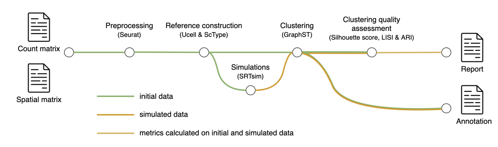

## Clustering Nextflow pipeline

### Options

```
--sample_name
--thr_min  (minimum count cutoff to filter spots)
--thr_max  (maximum count cutoff to filter spots)
--basal_thr  (basal Uscore threshold to define 'basal' spots)
--classical_thr  (classical Uscore threshold to define 'classical' spots)
--output
--seeds (seeds used to generate simulated spatial transcriptomics  data)
```
### Example

```
nextflow run filtering_clustering_pipeline.nf \
--sample_name Visium_FFPE_V43T08-051_D \
--thr_min 2500 \
--thr_max Inf \
--basal_thr 0.25 \
--classical_thr 0.25 \
--output nf_output \
--seeds 1,2
```



